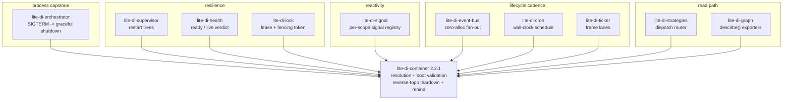
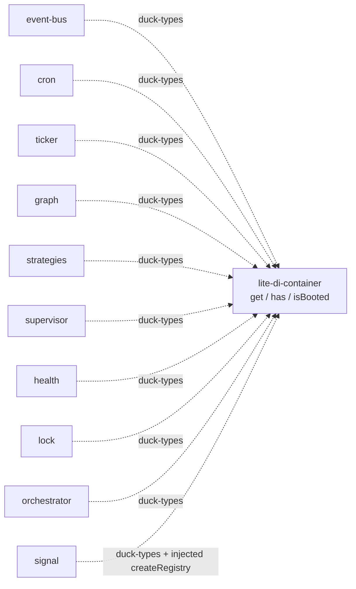

# @zakkster/lite-di-container

> Zero-magic, zero-dependency dependency injection for modern JavaScript and TypeScript. Explicit registration (value / singleton / transient / factory / multi / alias), boot-time graph validation, sync and async resolution, scopes, reverse-topological teardown -- with a cached `get()` that allocates 0 bytes per call. Built for long-running servers and hot resolution paths.

[](https://www.npmjs.com/package/@zakkster/lite-di-container)
[](https://github.com/sponsors/PeshoVurtoleta)

[](https://bundlephobia.com/result?p=@zakkster/lite-di-container)
[](https://www.npmjs.com/package/@zakkster/lite-di-container)
[](https://www.npmjs.com/package/@zakkster/lite-di-container)


[](./LICENSE)

## The dependency injection container the ecosystem was missing

Most DI libraries make you choose: the heavy framework (decorators, reflect-metadata, a compile step, magic string parsing) or the fifty-line `Map` that has no boot validation, no cycle detection, no teardown order, and quietly allocates on every resolve. `@zakkster/lite-di-container` is the missing middle: an **explicit** container -- you say exactly what each token is -- that validates the whole graph at `boot()`, detects cycles both statically and at runtime, tears services down in reverse resolution order, and keeps the one path that actually runs hot -- `get()` on a cached binding -- at **0 bytes per call**.

```bash
npm install @zakkster/lite-di-container
```

Zero runtime dependencies. Single ESM file. `node:test` only.

> **Renamed in v2.** This package was formerly published unscoped as `lite-di-container`. That name is **deprecated** and ends at v1 -- v2 and all future releases ship only as `@zakkster/lite-di-container`. Update your install and imports to the scoped name.

```js
import { Container } from '@zakkster/lite-di-container';

const c = new Container();

c.value('config', { port: 3000 });                 // raw value, returned as-is
class Database { constructor(config) { this.port = config.port; } }
c.singleton('db', Database, ['config']);           // built once, cached forever
class Logger { log(m) { /* ... */ } }
c.transient('logger', Logger);                     // fresh instance every get()
c.factory('requestId', () => crypto.randomUUID()); // called on every get()

c.boot();   // validate the whole graph + lock: typos and cycles fail HERE, not in prod

const db = c.get('db');          // instantiates Database, injects 'config'
const id = c.get('requestId');   // a fresh uuid
```

If you use TypeScript, pass a generic to `get` for full inference: `c.get<Database>('db')`.

---

## Table of contents

- [Why this exists](#why-this-exists)
- [What you get](#what-you-get)
- [The resolution core](#the-resolution-core)
- [API reference](#api-reference)
  - [Registration](#registration)
  - [Resolution](#resolution)
  - [Validation and boot](#validation-and-boot)
  - [Lifecycle](#lifecycle)
  - [TYPES constants](#types-constants)
- [Composability](#composability)
- [Zero-GC design notes](#zero-gc-design-notes)
- [Design decisions worth knowing](#design-decisions-worth-knowing)
- [Testing](#testing)
- [What this is not](#what-this-is-not)
- [Ecosystem](#ecosystem)
- [License](#license)

---

## Why this exists

Two problems that no small DI library solves at once:

1. **Wiring errors must fail at boot, not in production.** A typo in a dependency
   name or a circular chain (`a -> b -> a`) is a static property of your graph.
   `boot()` walks every declared dependency and every alias target, collects
   **all** wiring errors into one message, and runs a DFS for cycles -- so a
   misconfiguration throws at startup, before the container serves a single
   request. After `boot()`, the container is locked: no accidental runtime
   registration can drift the topology.

2. **Resolution is a hot path, and a hot path must not allocate.** A server that
   resolves a cached service thousands of times a second cannot afford a fresh
   array or closure per call -- those become GC pauses under load. The cached
   `get()` lane here is a single `Map` lookup and a return: **0 bytes per call**,
   gated in CI by `@zakkster/lite-gc-profiler`. The lanes that must allocate by
   construction (a transient builds a new instance; `getAll` returns a fresh
   array) are measured and pinned, never claimed away -- and `getAllInto(name, out)`
   gives you a fill-into-your-own-buffer form that allocates nothing.

Existing options: a decorator framework (heavyweight, needs a build step, couples
your classes to the container) or a hand-rolled `Map` (no validation, no cycle
detection, no teardown contract, and it allocates). This is the container for the
job in between.

---

## What you get

- **Explicit registration** -- `value`, `singleton`, `transient`, `factory`,
  `factoryAsync`, `singletonFactory`, `singletonFactoryAsync`, `multi`,
  `multiFactory`, `alias`. No decorators, no reflection, no magic. A token is a
  non-empty string or a symbol; anything else fails closed at registration.
- **Boot-time graph validation** -- `boot()` collects every unregistered
  dependency and every alias-to-nothing into one thrown message, then DFS-scans
  for cycles, then locks the container.
- **Sync and async resolution** -- `get` / `getAll` / `getAllInto` on the sync
  lane; `getAsync` / `getAllAsync` / `bootAsync` on the async lane, with a
  per-resolution context so concurrent async singletons build exactly once and
  cross-factory cycles reject instead of hanging.
- **Scopes** -- `scope()` returns a child that inherits the parent's bindings but
  owns its own overrides and lifetime. A child never writes into a parent's cache.
- **Reverse-topological teardown** -- `shutdown()` runs teardown hooks (or
  `Symbol.dispose` / `close` / `destroy`) in reverse resolution order, isolates
  failures into an `AggregateError`, and releases all retained state. It never
  writes to `console`.
- **Multi-bindings** -- register many implementations under one token with
  `multi` / `multiFactory`, resolve them all with `getAll`, or fill your own
  buffer with `getAllInto` for a zero-allocation hot loop.
- **First-class TypeScript** -- `Container.d.ts` declares every public member, and
  a pinned test asserts the declaration list against the runtime prototype so the
  types can never silently drift.

Full types ship in [`Container.d.ts`](./Container.d.ts).

---

## The resolution core

<details>
<summary>What `get()` does, lane by lane, and why the cached lane is free.</summary>

`get(name)` has one hot lane and several cold ones. The hot lane is the first two
lines: a shut-down check against a single integer state field, and a `Map` probe
into `_singletons`. On a cached hit it returns immediately -- one `Map.has`, one
`Map.get`, return. No array, no closure, no string built. That is the 0 B/call
lane the torture gate pins.

Everything else is cold and reached only on a cache **miss**:

- **VALUE** returns the registered reference as-is (including `null`, `0`, `''`,
  `false` -- value identity is preserved).
- **ALIAS** recurses to the target. Alias chains resolve transitively.
- **SINGLETON / TRANSIENT** allocate `new Array(deps.length)`, resolve each dep,
  and construct the class. A singleton caches the instance and pushes its name
  onto `_resolutionOrder` (the teardown contract); a transient does neither and
  builds fresh every time.
- **FACTORY** calls the factory with the container. A `singletonFactory` caches;
  a bare `factory` does not.

Multi-bindings live in their own maps, so the cached `get()` probe can never see
an array -- resolving a multi name through `get()` fails closed (`is multi. Use
getAll()`) rather than leaking the internal cache array. Cycle detection pushes
each name onto a per-container `_path` before resolving its deps and pops it in a
`finally`, so a re-entrant `get()` on a name already on the path throws
`Circular dependency detected: a -> b -> a`.

The async lane (`getAsync`) mirrors this but carries a per-resolution context
object (`{ path }`) created once at the top-level call and threaded through every
frame, including factory re-entries. That is what lets a cross-factory async cycle
reject with its full trace instead of recursing forever, and what lets N
concurrent `getAsync()` on one async singleton share a single in-flight promise.

</details>

---

## API reference

### Registration

```ts
value(name, definition): void                       // raw value, returned as-is
singleton(name, Class, deps?): void                  // built once on first get(), cached
transient(name, Class, deps?): void                  // fresh instance on every get()
factory(name, fn): void                              // fn(container) on every get(), not cached
factoryAsync(name, fn): void                         // async fn, resolved on every getAsync()
singletonFactory(name, fn): void                     // fn(container) once, result cached
singletonFactoryAsync(name, fn): void                // async fn once, resolved value cached
multi(name, Class, deps?): void                      // append a class to a multi-binding
multiFactory(name, fn): void                         // append a factory to a multi-binding
alias(aliasName, targetName): void                   // aliasName resolves to targetName
onTeardown(name, fn): void                           // teardown hook, fn(instance), run on shutdown
```

A token is a **non-empty string or a symbol**; anything else throws a `TypeError`
at registration. A factory definition that is not a function throws a `TypeError`
at registration, not on first resolve. Registration is a cold path and returns
`undefined` (no fluent chaining -- a 2.0.0 change from v1).

### Resolution

```ts
get<T>(name): T                                      // resolve one; 0 B/call on a cached hit
getAsync<T>(name): Promise<T>                        // async resolve; per-resolution cycle context
getAll<T>(name): T[]                                 // resolve a multi-binding; fresh array per call
getAllInto<T>(name, out): number                     // fill caller's array; 0 B/call when cached
getAllAsync<T>(name): Promise<T[]>                   // async multi resolve
has(name): boolean                                   // registered here or in any parent?
hasLocal(name): boolean                              // registered on THIS container only?
readonly isBooted: boolean                           // has boot() locked the container?
```

`get()` on an unregistered name throws `Service '<name>' is not registered.
Available: [...]`, listing the local tokens. `getAllInto` fails closed: a
non-array `out` is a `TypeError`, an `out` shorter than the binding is a
`RangeError`.

### Validation and boot

```ts
boot(): void            // validate the whole graph, then lock. Idempotent.
bootAsync(): Promise<void>   // boot(), then eagerly build every cached async binding once
```

`boot()` collects every unregistered dependency and alias target into one thrown
message and DFS-scans for cycles. After `boot()`, registration / `unregister` /
`clear` throw until `reset()` unlocks.

### Lifecycle

```ts
scope(): Container                                   // child scope: inherits bindings, owns its lifetime
shutdown(options?): Promise<void>                    // reverse-order teardown, then release
reset(): void                                        // flush caches + unlock; keep registrations
unregister(name): void                               // remove one binding (unlock first if booted)
clear(): void                                        // remove everything + unlock
```

`shutdown()` runs teardowns in reverse resolution order (a dependency after its
dependents), isolates failures, and rejects with an `AggregateError` after all
teardowns have run -- unless you pass `{ onTeardownError: (err, name) => ... }`,
which receives each failure and suppresses the aggregate. It never writes to
`console`, refuses to run while a child scope is live, and is a no-op on a second
call. An unknown option key fails closed with a did-you-mean hint.

### TYPES constants

`TYPES` is a frozen integer enum tagging each registry entry (a 2.0.0 change from
v1's string tags):

| Constant           | Value | Meaning                                              |
| ------------------ | ----- | ---------------------------------------------------- |
| `TYPES.VALUE`      | `0`   | A raw value, returned as-is.                         |
| `TYPES.SINGLETON`  | `1`   | A class built once and cached.                       |
| `TYPES.TRANSIENT`  | `2`   | A class built fresh on every resolve.                |
| `TYPES.FACTORY`    | `3`   | A factory function (cached iff `singletonFactory*`). |
| `TYPES.ALIAS`      | `4`   | Another name for a target token.                     |

`VERSION` is the package version string, kept in three-place sync with
`package.json` and this changelog.

---

## Composability

The full lifecycle -- container, scope, async boot, resolve, graceful shutdown --
in one pipeline:

```js
import { Container } from '@zakkster/lite-di-container';

// 1. Register the graph. Async singletons, a multi-binding, an alias.
const app = new Container();
app.value('config', { dsn: 'postgres://...' });

class Pool { constructor(config) { this.dsn = config.dsn; } async close() { /* drain */ } }
app.singletonFactoryAsync('db', async (c) => {
  const pool = new Pool(c.get('config'));
  await /* pool.connect() */ Promise.resolve();
  return pool;
});
app.onTeardown('db', (pool) => pool.close());   // torn down on shutdown

class MetricsPlugin { handle(e) { /* ... */ } }
class AuditPlugin   { handle(e) { /* ... */ } }
app.multi('plugins', MetricsPlugin);
app.multi('plugins', AuditPlugin);              // many under one token

app.alias('database', 'db');                    // an alternative name

// 2. Validate + eagerly build every cached async binding, exactly once.
await app.bootAsync();                           // typos / cycles would throw HERE

// 3. Resolve. A per-request child scope overrides one binding without touching
//    the parent's cache or resolution order.
const req = app.scope();
req.value('requestId', crypto.randomUUID());
const db = await req.getAsync('database');       // inherited from the parent, shared instance

// 3b. Fill your own buffer for a zero-allocation multi hot loop.
const out = new Array(2);
const n = app.getAllInto('plugins', out);        // 0 B/call once cached
for (let i = 0; i < n; i++) out[i].handle({ requestId: req.get('requestId') });

// 4. Tear down in reverse resolution order; release everything.
await req.shutdown();                            // child first (it owns its lifetime)
await app.shutdown();                            // then the parent: db.close() runs here
```

Every stage is explicit; the hot resolve loop passes a caller-owned array to
`getAllInto` and allocates nothing; teardown order is the reverse of the order the
services were built.

---

## Zero-GC design notes

<details>
<summary>What each resolution lane allocates, measured and gated.</summary>

Zero-alloc is a claim about **specific lanes**, not the whole package. The cached
`get()` hit and the fill-into-buffer `getAllInto` are hard-gated at literal zero.
The lanes that allocate by construction -- a transient builds an instance, `getAll`
returns a fresh array, an async frame allocates a promise -- are **pinned** at a
measured rate: a reduction is fine, an increase fails CI.

| Lane                                   | Measured      | Gate                   |
| -------------------------------------- | ------------- | ---------------------- |
| Sync cached `get()`                    | 0.000 B/call  | gate at 0 (hard)       |
| Value `get()`                          | 0.000 B/call  | gate at 0 (hard)       |
| `getAllInto` (fully cached multi)      | 0.000 B/call  | gate at 0 (hard)       |
| 3-dep transient `get()`                | 0.071 B/op    | pinned <= 8            |
| `getAll` (3-entry multi)               | 0.002 B/op    | pinned <= 16           |
| Async cached `getAsync()` hit          | 0.164 B/op    | maxMajor 0, pinned <= 32 |

The cached `get()` lane is a single integer compare (the LIVE/DRAINING/SHUT_DOWN
state field) plus one `Map.has` / `Map.get` -- no branch, array, closure or string
is built on a hit. Multi-bindings live in dedicated maps so that probe never sees
an array. The teardown contract (`_resolutionOrder`) and the undefined-singleton
flags (a single `Uint8Array` per multi name) are the container's only structural
state; a steady-state `getAll` loop grows that `Uint8Array` by exactly 0 bytes,
gated with `maxArrayBuffersGrowth: 0`.

The numbers above are re-measured at release by `test/torture/t6-alloc.mjs` under
`node --expose-gc`, and the whole graph is proven leak-free (`@zakkster/lite-leak`:
retention returns to 0 across 4096 scope churn cycles, heap growth under 512 KB).
`DI_TORTURE_BREAK=1` injects a retained allocation into the hot body and must make
the gate exit non-zero -- a budget that cannot fail is not a gate.

</details>

---

## Design decisions worth knowing

- **Binding shape: multi lives in its own maps** ([decisions/0001](./decisions/0001-binding-shape.md)).
  `_registry` / `_singletons` hold only single bindings; multi bindings use
  `_multiRegistry` / `_multiSingletons`. The cached `get()` probe can therefore
  never return an internal cache array -- the "is multi" rejection is structural,
  off the hot lane, at exactly one `Map` lookup per hit.
- **Async context is per-resolution, not per-container** ([decisions/0002](./decisions/0002-async-context.md)).
  One `{ path }` context is created at each top-level `getAsync` and threaded
  through every frame including factory re-entries. That is one object per
  top-level async call (async already allocates a promise per frame), and it keeps
  the sync lane untouched while making cross-factory cycles detectable.
- **Two-phase, releasing shutdown** ([decisions/0003](./decisions/0003-lifecycle.md)).
  `shutdown()` enters DRAINING (cached reads allowed, new construction rejected),
  runs teardowns in reverse resolution order with failure isolation, flips to
  SHUT_DOWN, and releases all retained state. A child scope owns its own lifetime;
  the parent refuses to shut down while a child is live rather than leave the child
  holding a dead parent.
- **The container ships alone** ([decisions/0004](./decisions/0004-signal-packaging.md)).
  No signal / reactive exports and no `@zakkster/lite-signal` dependency in the
  container itself. The reactive layer ships as its OWN package,
  `@zakkster/lite-di-signal` -- duck-typed onto the container (zero hard peer, it
  imports nothing from here), so the core stays zero-dependency and the reactive
  coupling is opt-in. See the [Ecosystem](#ecosystem) map below.

---

## Testing

**102 deterministic `node:test` cases, 0 failing, 0 todo**, plus a torture gate
that proves both leak-freedom and the per-lane allocation numbers. `node:test`
only -- no third-party test runner, no runtime test dependency.

```bash
npm test        # 102 node:test cases under --expose-gc
npm run torture # @zakkster/lite-leak + lite-gc-profiler: per-lane alloc gates + leak gate
npm run verify  # test + torture, the publish gate (also runs on prepublishOnly)
```

New to the container, or reaching for a specific pattern? The
[Cookbook](./COOKBOOK.md) has runnable recipes from your first container to the
zero-allocation hot path (`getAllInto`, scopes, graceful shutdown, gating your
own resolve path). It grows with the ecosystem.

The suites cover: the value / singleton / transient / factory contract; alias
transitivity and diamond sharing; scope override isolation and inheritance;
boot-time missing-dependency and cycle validation; the async lane (cross-factory
cycle rejection with a bounded timeout, concurrent-singleton dedup, rejected-build
eviction); two-phase shutdown with `AggregateError` reporting and a no-console
assertion; token policy; and a pinned prototype-surface test that fails if
`Container.d.ts` drifts from the runtime. The torture harness adds metamorphic
resolution laws, degenerate tokens, adversarial cycle sequences, the zero-alloc
gate, a 4096-cycle scope-churn soak, dependent smoke tests, and eight controls
that each prove a gate can fail. No gate output is a FAIL.

---

## What this is not

- **Not a decorator framework.** No `@Injectable`, no `reflect-metadata`, no build
  step, no coupling of your classes to the container. Registration is explicit and
  external.
- **Not a service locator you scatter through your code.** Resolve at the edges,
  inject through constructors. `get()` is for composition roots and factories, not
  for reaching into the container from deep in business logic.
- **Not a reactive system.** The container does not observe or recompute. The
  reactive layer (`@zakkster/lite-di-signal`) is a separate, duck-typed package
  (decision 0004); it is not bundled here.
- **Not a config loader, an HTTP framework, or a job runner.** Those live in the
  ecosystem dependents that consume this container, not in the container itself.

---

## Ecosystem

This container is the base of the **`@zakkster/lite-di-*` service kernel** -- a
self-healing, zero-GC backend service kernel assembled from single-file ESM bricks.
The container owns resolution, boot-time validation, reverse-topological teardown,
and post-boot `rebind` hot-swap; ten sibling modules layer capability on top of that
one spine. **None of them takes a hard dependency on the container** -- every module
duck-types it (`get` / `has` / `isBooted`) and ships with `dependencies: {}`. You add
only the bricks a given service needs.

<p align="center">
  
</p>

<p align="center"><sub>The kernel at a glance. An interactive version lives in <a href="diEcosystem/index.html"><code>diEcosystem/index.html</code></a>.</sub></p>

<p align="center"><sub><b>Seen in production shape:</b> <a href="https://zakkster.github.io/LiteDiContainer/diEcosystem/market-map/">the live <code>market-map</code> demo</a> -- a self-healing, zero-GC market-data kernel running this whole ring in the browser -- source under <a href="diEcosystem/market-map/"><code>diEcosystem/market-map/</code></a>.</sub></p>

<p align="center">
  <a href="https://github.com/PeshoVurtoleta/lite-di-container/actions/workflows/ci.yml"></a>
</p>
<p align="center"><sub>CI proves the <a href="diEcosystem/market-map/"><code>market-map</code></a> demo headless: node:test on 20/22/24, a lite-leak torture + alloc gates, and an inverted break-gate (an armed canary that exits 0 turns CI red). The Pages deploy is gated on all three.</sub></p>

### The layers

Each tier sits on the container and does exactly one job the tier below does not.



### One request's life

Boot, serve, and retire a service -- the modules compose end to end, and every
teardown runs in the container's reverse-topological order.

```mermaid
sequenceDiagram
    participant P as process
    participant O as orchestrator
    participant St as strategies
    participant Sv as supervisor
    participant H as health
    participant C as container

    O->>C: bootAsync() validate graph + lock
    O->>Sv: start supervision tree
    Note over C,St: serving requests
    St->>C: resolve(select(input)) -&gt; impl
    Sv->>C: check() watches children (0 B/poll)
    H->>Sv: readyz() reads the supervisor verdict
    P-->>O: SIGTERM
    O->>Sv: supervisor.shutdown()
    O->>C: container.shutdown()
    C->>C: reverse-topo teardown (each scope's signal registry destroyed LAST)
    O->>P: exit(code) once
```

### Zero hard peers -- the selling point

Every module reaches the container through the same tiny duck-typed surface and
imports nothing from it. There are **no module-to-module hard arrows**: you can adopt
any single brick without pulling the rest.



### What each module is for

One row per module: the one job only it does, and the gap it closed in the kernel.
Taglines are each package's own `llms.txt` positioning line.

| Module | The one job only it does | Role |
| ------ | ------------------------ | ---- |
| **`lite-di-container`** `2.2.1` | resolution + boot-time graph validation + reverse-topo teardown + post-boot `invalidate`/`rebind` hot-swap | the base (rebind = GAP-3) |
| `lite-di-strategies` | fail-closed zero-GC strategy router over a booted container | read-path dispatch hinge |
| `lite-di-graph` | read-only JSON / Graphviz-DOT / Chrome-Trace exporters over a `describe()` snapshot | topology observability |
| `lite-di-event-bus` | DI-constructed handlers under a boot-locked `multi`, dispatched by index over one bus buffer | zero-alloc fan-out |
| `lite-di-cron` | wall-clock task scheduler over a DI topology | time-driven cadence |
| `lite-di-ticker` | static, DI-wired system ticker for `lite-raf` frame lanes | frame-driven cadence |
| `lite-di-supervisor` | OTP-style supervision tree over a DI topology | GAP-1, self-healing keystone |
| `lite-di-health` | fail-closed readiness / liveness aggregator | GAP-4, readiness surface |
| `lite-di-lock` | a DI-scoped lock lifecycle over a pluggable store | mutual-exclusion / lease hinge |
| `lite-di-orchestrator` | graceful-shutdown / process-lifecycle capstone (SIGTERM -> drain -> exit once) | GAP-2, process capstone |
| `lite-di-signal` | each container scope gets its own isolated `lite-signal` registry, destroyed on scope teardown | reactivity pillar (last brick) |

### Shared foundation

- [`lite-signal`](https://www.npmjs.com/package/@zakkster/lite-signal) -- zero-GC reactive graph; the registry `lite-di-signal` scopes (injected, never imported)
- [`lite-leak`](https://www.npmjs.com/package/@zakkster/lite-leak) -- retention torture kernels (dev dep across the line)
- [`lite-gc-profiler`](https://www.npmjs.com/package/@zakkster/lite-gc-profiler) -- allocation and GC budget gates (dev dep across the line)
- **`@zakkster/lite-di-container`** -- this package (formerly unscoped `lite-di-container`, now deprecated)

The ten sibling modules are published at `1.0.0` and are torture-green; their
graduation history is tracked in [`PROMOTION_LADDER.md`](./PROMOTION_LADDER.md).

---

## License

MIT (c) Zahary Shinikchiev <shinikchiev@yahoo.com>
