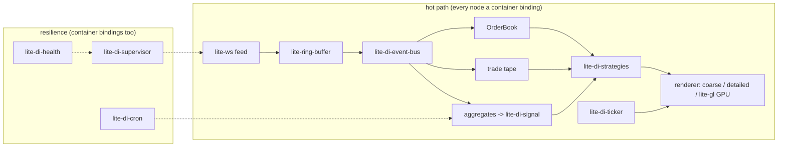

# market-map -- a `@zakkster/lite-di-*` browser demo

> A self-healing, zero-GC market-data kernel that runs in the browser -- 15 zero-dependency single-file ESM packages, no bundler.

**Live (nothing to install):** https://zakkster.github.io/LiteDiContainer/diEcosystem/market-map/

<!-- Hero GIF (owner-manual capture, T1): a ~5s loop of the Kill-feed heal -- click
     "Kill feed", the event log shows fault -> restart -> fresh socket, the restarts
     counter ticks up, and the viz never blanks. <= 900 CSS px, <= 3 MB, 12-15 fps.
     Drop the file at ./assets/kill-feed.gif and uncomment the block below:
<p align="center"></p>
-->

[](https://github.com/PeshoVurtoleta/lite-di-container/actions/workflows/ci.yml) &middot; [Pages deploy](https://github.com/PeshoVurtoleta/lite-di-container/actions/workflows/ci.yml) &middot; MIT (c) Zahary Shinikchiev

## The demo the ecosystem was missing

A **skeleton**, not a product: a real-time market-data / telemetry ingestion kernel
built from the actual `lite-di-*` packages, running **in the browser** with a thin
Canvas2D order-book viz. It is the "hybrid" demo -- the headless kernel does the real
work; the visualization is the `ticker`/render showcase on top. An in-browser DI
kernel is the honest test: a browser has no forgiving server GC budget -- you get
~16.6 ms a frame or you drop it -- so a zero-GC claim either holds on screen or it
does not.

## What is on screen

The flagship controls, each with the exact event-log line it emits:

- **Symbol tabs (`scope()`)** -- open a symbol and the container spins up a child
  scope with its own signal registry: `scope: BTCUSDT opened -- child scope + own
  signal registry (N bindings)`.
- **Kill feed -> watch it self-heal** -- the supervisor faults the feed and
  re-resolves a fresh `lite-ws` socket: `BTCUSDT: feed re-resolved -- dialing a
  fresh socket` (the `restarts` counter increments; the viewport never blanks).
- **Swap renderer build (rebind, GAP-3)** -- a genuine post-boot binding
  replacement, not a strategy selection: `rebind: renderer:gpu -> v2 (post-boot
  hot-swap, GAP-3)`.
- **Shutdown kernel** -- children drain first, then reverse-topological teardown:
  `shutdown: kernel draining -- children first`, then per scope `scope: BTCUSDT
  closed -- teardown: feed -> traceBus -> bus -> signal-registry`, then `shutdown:
  complete -- N teardowns, clean`.
- **Burst x100 (10s)** -- pumps 100 synthetic ticks per frame into the active
  scope's real pipeline so you can watch `p99` hold flat under 100x throughput.

## Architecture

Every node below is a `lite-di-container` binding; the dashed edges are the
resilience siblings that watch, heal, and schedule the hot path.



## Run it

**Live (nothing to install):** https://zakkster.github.io/LiteDiContainer/diEcosystem/market-map/

It opens cold and paints a moving price trace + order-book ladder within ~3s. The default
feed is a **live Binance BTCUSDT** stream; if that socket is unreachable, a supervised
watchdog degrades to an **in-page simulation** within ~5s (watch the event log) -- so the
demo is never a blank canvas.

**Run locally** -- serve *this directory* over any static server:

```bash
python3 -m http.server 8099 --bind 127.0.0.1
```

Then open `http://127.0.0.1:8099/` from within this folder. The import map is pinned to
published packages on a CDN, so no `node_modules` and no build step are needed -- just a
static file server.

**Optional local feed** -- a zero-dep Node WebSocket server streaming synthetic ticks, for
offline work against a controllable source:

```bash
node feed-server.mjs            # ws://127.0.0.1:8100
```

Then pick **local (feed-server)** in the feed selector.

No build step, no bundler. Every package is zero-dep single-file ESM, resolved in-browser
by a version-pinned import map (see the comment above the map in `index.html` for the
pin-bump procedure).

## What each package does here

One row per import-map entry in `index.html` (16 specifiers). The **Version** column
is the exact CDN pin -- the import map is the single source of truth.

| Package | Version | Role in the demo |
| --- | --- | --- |
| `lite-di-container` | 2.2.0 | the graph: scopes, values, singletons, boot-time validation (17 nodes) |
| `lite-di-event-bus` | 1.1.0 | 0 B/emit fan-out of each decoded tick to book / tape / aggregate handlers; **records** the session for replay |
| `lite-di-strategies` | 1.0.0 | selects the renderer by zoom: coarse Canvas2D -> detailed Canvas2D (price labels) -> **lite-gl GPU** past 2.2x -- read-path, 0 B/op |
| `lite-di-cron` | 1.0.0 | wall-clock housekeeping: rolling aggregation, stale-array prune, heartbeat ping |
| `lite-di-ticker` | 1.0.0 | the rAF render loop driving the repaint |
| `lite-di-supervisor` | 1.0.0 | watches the feed subsystem; on a fault it re-resolves a **fresh socket** without dropping the render loop |
| `lite-di-health` | 1.0.0 | `readyz` / `livez` over the feed + supervisor |
| `lite-di-graph` | 1.0.0 | exports the booted dependency graph (node count / a JSON profile) |
| `lite-di-signal` | 1.0.0 | the reactive control surface -- a **handful** of aggregates (mid / bid / ask / spread), NOT one signal per tick |
| `lite-raf` | 1.2.0 | the `requestAnimationFrame` frame source under `lite-di-ticker` (fails closed with no global rAF) |
| `lite-signal` | 1.5.0 | the underlying reactive cell primitive the aggregate signals are built on |
| `lite-signal-decorators` | 1.5.0 | `defineReactive` builds each symbol scope's 10-node view-model (bid/ask/last -> mid/spread deriveds + a `localTo` alert) on the scope's OWN registry; disposed with the scope |
| **`lite-ws`** | 1.0.0 | the **real WebSocket feed**: `onMessage` pipes each decoded frame to the bus (0-GC), while `status` / `latency` / `reconnectAttempts` stay coarse reactive signals; built-in reconnect + backoff. Selectable at runtime between a **live Binance combined stream** (default; `@depth20@100ms` + `@aggTrade` + `@bookTicker` over wss, no auth), an **in-page simulation** (synthetic random walk, the supervised failover), and the local `feed-server` |
| **`lite-ring-buffer`** | 1.0.1 | the pow2, bitmask-wrap `Float32Array` tick ring -- the 0-GC hot data the firehose lands in |
| **`lite-gl`** | 2.0.0 | instanced WebGL2 renderer: the tick cloud via `createPointSink` **and the depth ladder via `createQuadSink`** (the whole order book on the GPU); scales to ~1M primitives |
| `lite-gl/backend` | 2.0.0 | the same package's headless-importable sink factories -- imported cold by the S6 `bootKernel` seam, never at module top level |

The headline beat: click **Kill feed** -- the supervisor faults the feed subsystem, tears
down the old `lite-ws` socket, and re-resolves a fresh one (restarts++, transport
`reconnecting` -> `open`) while the viewport keeps rendering. That is the golden niche in
miniature: self-healing, fail-closed, zero-GC steady state -- over a real socket.

## Corrected architecture (vs the naive mapping)

- The tick **firehose lands in a `lite-ring-buffer`** (pow2 `Float32Array`, bitmask wrap)
  -- 0-GC hot data. `lite-di-signal` holds only aggregates. One signal per tick would
  allocate and defeat the whole pitch (`lite-ws` exists precisely to avoid that trap).
- `strategies` **selects** a pre-registered renderer; it does not hot-swap (that is
  `container.rebind`). `event-bus` **fans out** already-decoded ticks; the socket read is
  `lite-ws`'s `onMessage` pipe upstream.

## Seams to turn this into a product (grep `SEAM:` in `kernel.js` / `feed-server.mjs`)

- **Done:** real WebSocket transport (`lite-ws`, incl. a live Binance combined feed); a REAL
  20-level depth ladder (`@depth20@100ms`) and a REAL trade tape (`@aggTrade`) off the wire,
  driving the full ladder from real levels instead of a synthesized spread; GPU rendering of
  the tick cloud, the trades and the order book (`lite-gl` point + quad sinks).
- Grow `RING` toward `lite-gl`'s ~1M; offer the `graph` JSON (`toJSON`) as a downloadable
  performance profile; add a WebGL LINE sink for a thick price polyline.

## Data provenance

One row per selectable source, one column per layer. `real` = off the wire /
a real socket; `synthetic` = fabricated in the exact Binance shape. Only the live
Binance feed is real market data; the HUD labels every synthetic layer on screen.

| Source | Transport | Top-of-book | Ladder | Trade tape |
| --- | --- | --- | --- | --- |
| `binance` (default) | real (wss) | real (`@bookTicker`) | real (`@depth20@100ms`) | real (`@aggTrade`) |
| `local` (feed-server) | real (ws socket) | synthetic | synthetic (HUD reads `WIRE` -- real depth arrays, synthetic numbers) | synthetic |
| `sim://random-walk` | synthetic (in-page) | synthetic | synthetic (HUD reads `SYNTH`) | synthetic |

## Honest caveats

With **Binance** selected the transport, the top-of-book (`bid` / `ask` / `mid`), the
**20-level ladder** (`@depth20@100ms`) and the **trade tape** (`@aggTrade`) are all **real,
live data** -- the ladder is drawn from real depth levels and every trade dot is a real
aggregated trade off the wire. The dense price trace comes from the combined `@bookTicker`
quote; a live quote never overwrites the real depth ladder -- the ladder is fabricated only
when no real depth is arriving (the simulation). `@depth20` is consumed as a
**partial-book snapshot**: each frame replaces the top 20 levels wholesale, with no `U`/`u`
diff-sequence maintenance or resync (that is what keeps the apply zero-allocation).

The **simulation** source is fully synthetic and fabricates its ladder from a single quote,
so the HUD `ladder` row reads **SYNTH** -- it is the labeled in-page failover used when the
live socket is unreachable, never presented as real data. With **local** selected,
`feed-server.mjs` streams synthetic depth + trade frames in the exact Binance shape, so the
ladder is driven from real depth arrays (HUD reads **WIRE**) even though the underlying
numbers are synthetic; only the live Binance feed is real market data. Either way it shows
the **architecture and package composition** at real firehose rates -- not a trading system.

The **alert threshold** row is a `@localTo` member of the per-symbol reactive VM
(`@zakkster/lite-signal-decorators`): unpinned it follows live mid, pinned it freezes to a
constant anchor. Its reset carries a shipped, documented ABA contract, quoted verbatim from
`SignalDecorators.d.ts`:

> The ABA contract (shipped, documented): the reset requires the upstream to
> change relative to the last adoption, not to have merely moved -- upstream
> A -> local write X -> upstream B -> upstream back to an equals-A value shows
> the STALE local X.

In this demo that means: unpinning while mid has returned to an `Object.is`-equal value
keeps the stale pinned threshold -- visible, documented, not a bug.

### The pooled watchlist (park vs dispose)

The **Watchlist** panel is a second lifetime, distinct from tabs. A **tab** open/close is a
scope OPEN/SHUTDOWN -- `scope.shutdown()` disposes the child scope, its VM, and its scoped
`lite-signal` registry for good. A **watchlist** park/revive is `releaseReactive` /
`reinitReactive` over a **retained** scope: the child scope, its registry, and its
per-scope `defineReactive` wrapper class all survive. Three caveats worth stating outright:

- **Park is REVERSIBLE, dispose is TERMINAL.** `releaseReactive(vm)` parks the VM -- its
  reactive nodes are released back to the scoped pool but the object survives, and
  `reinitReactive(vm, initials)` revives the **same object** (identity is stable across every
  revive). `disposeReactive(vm)` (what `scope.shutdown()` runs) is terminal: the VM is gone
  and any later read fails closed with `ReactiveDisposedError`. A watchlist remove NEVER
  fires `scope.shutdown()`. This is what makes subscribe/unsubscribe churn zero-GC: 4096
  park/revive cycles return `activeNodes` / `activeLinks` / `poolGrowths` to their exact
  baseline (proven headless in `test/09-watchlist.test.mjs`).

- **A snapshot includes deriveds; the revive filter is mandatory.** `snapshotOf(vm)` returns
  every member INCLUDING the deriveds `mid` and `spread`. `reinitReactive` rejects any key
  that is not a `@reactive` signal or a `@localTo` local, throwing and naming it -- feeding a
  raw snapshot straight back throws with a message naming `mid`. Export/import therefore runs
  the snapshot through the named `toInitials(snap, scratch)` filter, which copies only the six
  resettable keys (`bid`, `ask`, `last`, `pinned`, `pinAnchor`, `alert`) and drops the
  deriveds. The filter is load-bearing, not decorative (the negative case is a gate).

- **`costOfInstance` is a LIVE probe, not the static ceiling.** The per-symbol `nodes` /
  `links` row reads `costOfInstance(vm)` -- the cost of the graph that has actually formed on
  THIS instance. It is uncached (allocates a frozen row per call), so it is sampled COLD (at
  most 1 Hz / on park transitions), never inside the 120 ms HUD poll. It THROWS on a parked VM
  (`ReactiveDisposedError`), so a parked row renders `parked`, gated on the entry's own live
  flag -- never a blank swallowed from a caught throw. Contrast `costOf(Class)`, the static
  per-class ceiling used to size the scope registry (`capacityFor`): a live probe reads at or
  below the ceiling until every derived has been exercised. Size a registry from `costOf`,
  never from the live probe.

## Perf & exports

The **Perf & soak** HUD group makes the zero-GC / self-healing claims measurable on
screen: `fps`, frame `p99` (a histogram over the newest 600 frame deltas at 0.25 ms
bucket resolution -- no per-frame sort, no allocation), `worst frame`, `long tasks`
(via a `longtask` `PerformanceObserver`; reads `n/a` where the API is unsupported),
`ring` occupancy (saturates at `100%` and stays there -- a falling number would mean the
firehose ring is being reallocated), `uptime`, `restarts`, and an optional `heap` row
(Chrome-only, coarse; `n/a` elsewhere). The footer narrates a live soak line. **`Burst
x100 (10s)`** pumps 100 synthetic ticks per frame straight into the active scope's real
pipeline (tape + `signal` aggregates + `event-bus` + trace recorder), bypassing the
socket, so you can watch `p99` hold flat under two orders of magnitude more throughput;
the `quotes / s` row is tagged `(burst)` so a synthetic number is never read as wire rate.

Measured soak (desktop Chrome, GPU mode, 10-min Binance -- **pending the owner's DevTools
run; cells below are placeholders, not fabricated numbers**):

| metric | idle | under burst |
| --- | --- | --- |
| fps | _pending_ | _pending_ |
| frame p99 | _pending_ | _pending_ |
| worst frame | _pending_ | _pending_ |
| long tasks (> 50 ms, after 30 s warm-up) | _pending_ | _pending_ |
| tps (quotes+depth / s) | _pending_ | _pending_ |

The **graph export** row downloads the top-level kernel dependency graph via
`@zakkster/lite-di-graph` in three formats: `JSON` (`toJSON`), `DOT` (`toDOT`, Graphviz),
and `Chrome-Trace` (`toChromeTrace`). Load the trace at **ui.perfetto.dev** or
**chrome://tracing** (`market-map-graph.trace.json`). Note: the Chrome-Trace is
`lite-di-graph`'s documented **synthetic-timeline** mapping of the DI dependency graph
(`ts` = teardown rank, each edge a matched `s`/`f` flow pair) -- it visualizes the graph as
a trace, **not** a wall-clock frame profile. The export covers the parent container only;
each symbol tab is a separate child scope with its own graph.

## Testing

The demo is not proven by driving the page -- it is proven by booting the **real
kernel headless** under `node:test`. S6 added a `bootKernel({ ctx: null,
socketFactory, glSinks })` seam so the DI graph boots with a fake socket factory
and cold GL sinks, then the suites assert heal, reverse-topological teardown
order, and scope-churn leak-freedom (under `@zakkster/lite-leak`, `--expose-gc`).

```bash
npm test          # node:test boundary suites
npm run torture   # lite-leak + lite-gc-profiler soak
npm run alloc     # zero-alloc parse / apply-depth gates
npm run churn     # 256 open/close cycles, size() must return to 0
```

CI runs these on node 20/22/24 and adds an **inverted break-gate**: an armed leak
canary (`TORTURE_LEAK=1`) that exits 0 turns CI red, so the leak gate cannot rot
into a tautology. The Pages deploy is gated on all three jobs.

Coverage boundary: the on-screen GL draw path and the DevTools soak numbers are
**not** in the headless suite -- the GL path rides `lite-gl`'s own smoke test, and
the soak table above is filled from a manual owner protocol (see
[`WHY-market-map.md`](./WHY-market-map.md), "Not measured").

## Design notes and what was rejected

- [`WHY-market-map.md`](./WHY-market-map.md) -- the measured decisions: the
  RING = 65536 upload measurement, why the browser and not a Node service, why no
  bundler.
- [`REJECTED.md`](./REJECTED.md) -- the design ledger: one signal per tick,
  hot-swap via strategies, Playwright E2E, direct ring upload, and the deferrals,
  each with **Design / Rejected because / Chosen instead**.

## What this is not

Not a trading system. It carries no order entry, no position or risk state, and
no strategy logic; the `local` and `sim` sources are synthetic and labelled as
such on screen. It is a proof that a self-healing, zero-GC DI kernel composed
from single-file ESM bricks holds up at real firehose rates in a browser -- the
architecture and package composition, not the finance.

## Ecosystem

Part of [`@zakkster/lite-di-*`](../../README.md) -- a zero-dependency service
kernel: the container plus ten capability siblings (graph, cron, ticker,
event-bus, signal, strategies, lock, supervisor, health, orchestrator). This demo
wires fifteen of them (plus `lite-ws`, `lite-ring-buffer`, `lite-raf`,
`lite-signal`, `lite-gl`) into one running system.

## License

MIT (c) Zahary Shinikchiev &lt;shinikchiev@yahoo.com&gt;
